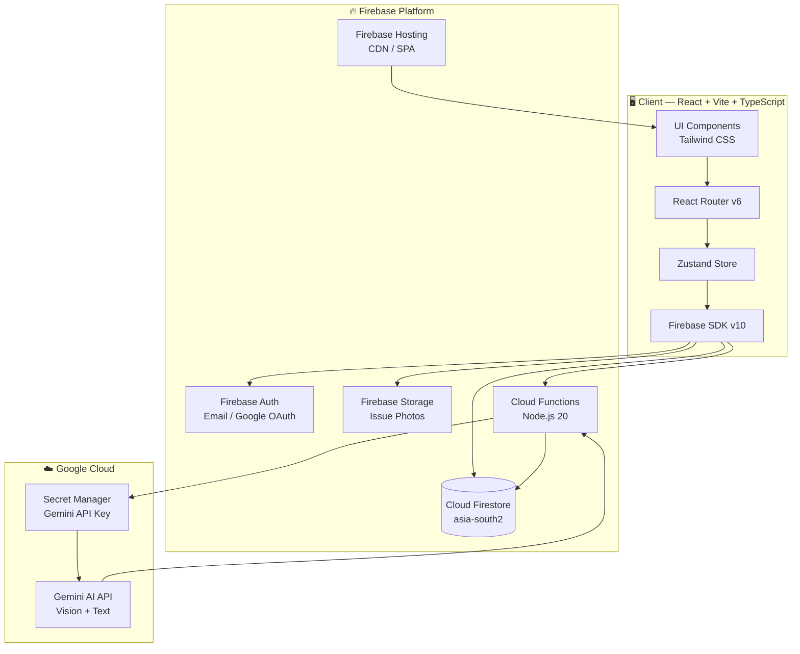
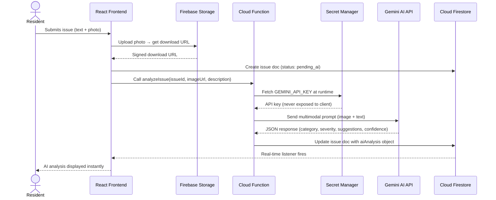
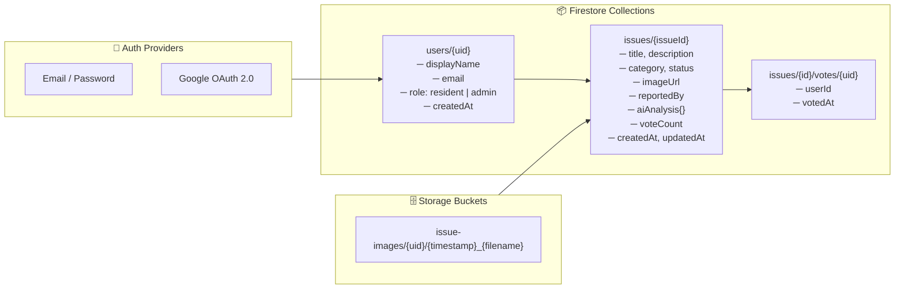
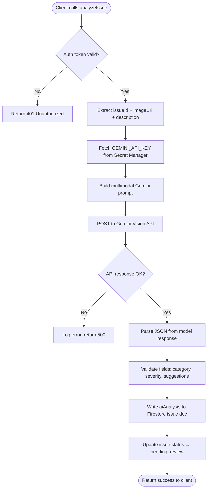
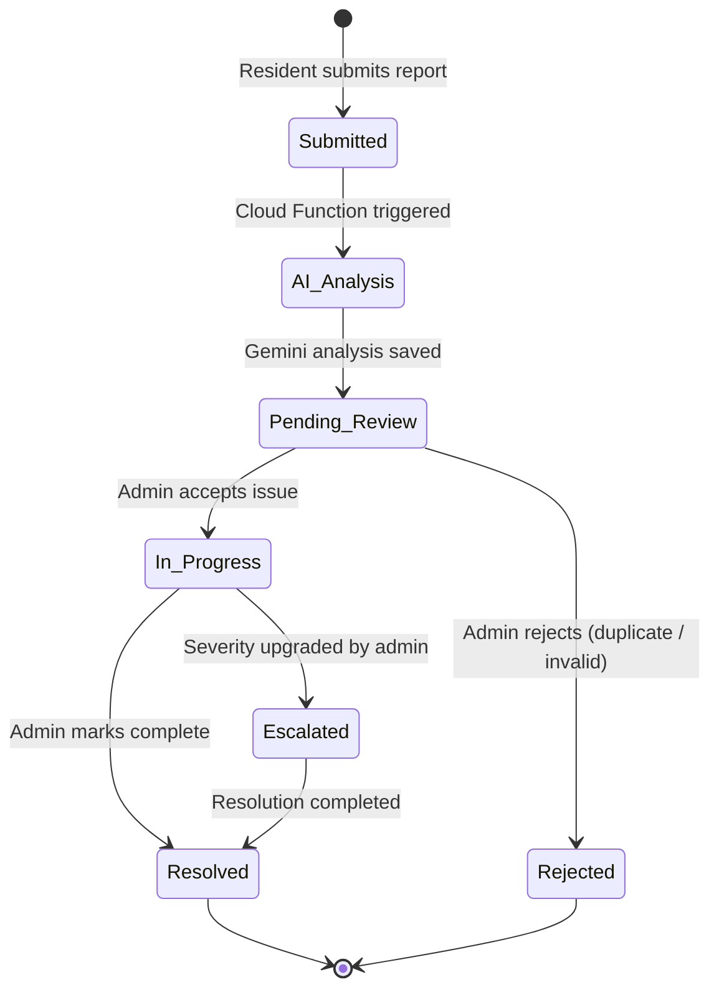

<div align="center">

<br />

<!-- LOGO / TITLE -->
<h1>
  
</h1>

<p align="center">
  <strong>AI-powered community issue reporting and resolution platform.<br/>
  Empowering citizens. Enabling administrators. Driven by Gemini AI.</strong>
</p>

<br />

<!-- BADGES ROW 1 — Hackathon & Status -->
<p align="center">
  <a href="https://www.codingninjas.com/">
    
  </a>
  &nbsp;
  
  &nbsp;
  
</p>

<!-- BADGES ROW 2 — Tech Stack -->
<p align="center">
  
  &nbsp;
  
  &nbsp;
  
  &nbsp;
  
  &nbsp;
  
  &nbsp;
  
  &nbsp;
  
</p>

<br />

---

</div>

## 📋 Table of Contents

- [Overview](#-overview)
- [Features](#-features)
- [Architecture](#-architecture)
- [Screenshots](#-screenshots)
- [Tech Stack](#-tech-stack)
- [Project Structure](#-project-structure)
- [Installation & Setup](#-installation--setup)
- [Firebase Configuration](#-firebase-configuration)
- [Gemini AI Integration](#-gemini-ai-integration)
- [Security](#-security)
- [Performance](#-performance)
- [Roadmap](#-roadmap)
- [Contributing](#-contributing)
- [License](#-license)
- [Author](#-author)

---

## 🔍 Overview

### The Problem

Urban communities face a persistent accountability gap in civic infrastructure management. Potholes go unrepaired for months. Broken streetlights create safety hazards. Drainage failures flood neighbourhoods. The reasons are systemic:

- **Fragmented reporting channels** — residents resort to phone calls, social media posts, or in-person visits that leave no audit trail.
- **No prioritisation intelligence** — municipal teams treat a cracked pavement the same as a collapsed road because there is no data to differentiate severity.
- **Zero visibility** — once a complaint is filed, residents receive no updates, eroding trust in local government.
- **Manual admin overhead** — administrators spend hours triaging, categorising, and routing issues that could be automated.

### Why Existing Solutions Fall Short

Generic ticketing platforms (311 systems, email helpdesks) were built for internal IT workflows, not citizen engagement. They lack image understanding, AI-driven severity scoring, community upvoting, and real-time status broadcasting. Standalone apps exist for specific cities but are siloed, expensive to operate, and impossible to customise without significant engineering resources.

### How CivicPulse AI Solves It

CivicPulse AI is a **full-stack, serverless civic-tech platform** that combines the power of Google's Gemini AI with Firebase's real-time infrastructure to create an end-to-end issue lifecycle — from citizen photo upload to AI analysis to admin resolution.

| Capability | Traditional Systems | CivicPulse AI |
|---|---|---|
| Issue Submission | Text forms only | Photo + text + location |
| Triage | Manual review | Gemini AI auto-classification |
| Severity Detection | None | AI-scored 1–5 with justification |
| Citizen Feedback | None | Community upvoting + comments |
| Admin Dashboard | Email inbox | Real-time Firestore dashboard |
| Transparency | None | Live status updates per issue |
| Infrastructure | Hosted servers | Serverless Firebase + Cloud Functions |

---

## ✨ Features

<details>
<summary><strong>👤 Resident Features</strong></summary>
<br />

- **Issue Reporting** — Submit civic issues with title, description, category, and optional photo attachments stored in Firebase Storage.
- **Real-Time Status Tracking** — Watch issue status update live via Firestore listeners — from `Pending` to `In Progress` to `Resolved`.
- **Community Upvoting** — Vote on issues reported by other residents to surface the most impactful problems for administrators.
- **Personal Dashboard** — View all personally submitted issues with current status, AI analysis, and admin comments in a single view.
- **Issue Feed** — Browse all community-reported issues filtered by category, severity, or status.
- **Authentication** — Secure sign-up and sign-in with Firebase Authentication (email/password and Google OAuth).
- **Responsive UI** — Fully mobile-first interface built with Tailwind CSS for seamless use from any device.

</details>

<details>
<summary><strong>🛡️ Admin Features</strong></summary>
<br />

- **Admin Dashboard** — Centralized view of all issues across the platform with real-time count indicators for pending, in-progress, and resolved states.
- **Issue Management** — Update issue status, add resolution notes, and mark issues as resolved with timestamp tracking.
- **AI-Assisted Triage** — Each submitted issue surfaces its Gemini AI analysis — severity score, category classification, and suggested resolution steps — directly in the admin panel.
- **Priority Queue** — Issues are surfaced by AI-assigned severity score and community vote count, enabling intelligent workload prioritisation.
- **Role-Based Access Control** — Admin routes and operations are gated by role verification via Firestore user documents, preventing unauthorised access.
- **Bulk Overview** — Filter and sort issues by status, category, severity, or date to manage high-volume issue queues efficiently.

</details>

<details>
<summary><strong>🤖 AI Features (Gemini)</strong></summary>
<br />

- **Multimodal Image Analysis** — When a resident uploads a photo with their report, Gemini Vision analyses the image to independently verify and describe the issue.
- **Automatic Severity Scoring** — Gemini assigns a severity level (1 = Minor → 5 = Critical) based on the visible damage, potential public risk, and description context.
- **Intelligent Classification** — Issues are auto-categorised into types (Pothole, Drainage, Lighting, Sanitation, Structural, Other) without requiring manual admin input.
- **Resolution Suggestions** — Gemini generates actionable resolution recommendations tailored to the specific issue type and severity for the admin team.
- **Feedback Summarisation** — Community comments and upvote patterns are synthesised into a coherent feedback summary for admin context.
- **Confidence Scoring** — Each AI analysis includes a confidence percentage so admins can gauge how certain the model is about its classification.

</details>

<details>
<summary><strong>⚙️ Backend Features (Cloud Functions)</strong></summary>
<br />

- **Secure AI Invocation** — Cloud Functions act as a trusted proxy layer between the client and Gemini API, ensuring API keys never reach the browser.
- **Secret Manager Integration** — The Gemini API key is stored and retrieved at runtime from Google Cloud Secret Manager — never hard-coded.
- **Firestore Triggers** — Callable and triggered Cloud Functions update Firestore documents atomically on issue creation and status changes.
- **CORS-Configured Endpoints** — Functions are configured with appropriate origin policies to allow only the hosted frontend domain.
- **TypeScript Runtime** — All Cloud Functions are authored in TypeScript with strict type checking, compiled before deployment.
- **Independent Deployment** — Functions are deployed independently of the frontend, enabling zero-downtime backend updates.

</details>

<details>
<summary><strong>🔥 Firebase Features</strong></summary>
<br />

- **Firestore** — NoSQL document database storing users, issues, votes, and AI analysis results with real-time sync listeners on the frontend.
- **Authentication** — Firebase Auth handles identity management with support for email/password and Google sign-in providers.
- **Cloud Storage** — Issue photos are uploaded directly from the browser to Firebase Storage with signed URL access and per-user path isolation.
- **Hosting** — The production React build (`dist/`) is deployed to Firebase Hosting with SPA rewrite rules for client-side routing.
- **Cloud Functions** — Node.js 20 serverless functions deployed to the `asia-south2` region for low-latency serving to South Asian users.
- **Firestore Indexes** — Compound indexes defined in `firestore.indexes.json` enable complex multi-field queries on the issues collection.

</details>

---

## 🏗️ Architecture

### Overall System Architecture



### AI Workflow



### Firebase Architecture



### Cloud Function Flow



### Issue Lifecycle



---

## 📸 Screenshots

> **Note:** Replace the placeholder blocks below with actual screenshots after deployment. Recommended tool: [Screely](https://screely.com) for framed browser mockups.

<table>
  <tr>
    <td align="center">
      <strong>🏠 Home / Landing</strong><br/>
      <kbd>screenshots/home.png</kbd>
    </td>
    <td align="center">
      <strong>🔐 Login / Register</strong><br/>
      <kbd>screenshots/login.png</kbd>
    </td>
  </tr>
  <tr>
    <td align="center">
      <strong>📊 Resident Dashboard</strong><br/>
      <kbd>screenshots/resident-dashboard.png</kbd>
    </td>
    <td align="center">
      <strong>📝 Report an Issue</strong><br/>
      <kbd>screenshots/report-issue.png</kbd>
    </td>
  </tr>
  <tr>
    <td align="center">
      <strong>🤖 AI Analysis Panel</strong><br/>
      <kbd>screenshots/ai-analysis.png</kbd>
    </td>
    <td align="center">
      <strong>🛡️ Admin Dashboard</strong><br/>
      <kbd>screenshots/admin-dashboard.png</kbd>
    </td>
  </tr>
  <tr>
    <td align="center">
      <strong>🔎 Issue Detail View</strong><br/>
      <kbd>screenshots/issue-detail.png</kbd>
    </td>
    <td align="center">
      <strong>⚙️ Settings</strong><br/>
      <kbd>screenshots/settings.png</kbd>
    </td>
  </tr>
</table>

---

## 🛠️ Tech Stack

| Layer | Technology | Version | Purpose |
|---|---|---|---|
| **Frontend Framework** | [React](https://react.dev) | 18.3 | Component-based UI |
| **Language** | [TypeScript](https://www.typescriptlang.org) | 5.2 | Type-safe JavaScript |
| **Build Tool** | [Vite](https://vitejs.dev) | 5.4 | Lightning-fast HMR & bundling |
| **Styling** | [Tailwind CSS](https://tailwindcss.com) | 3.4 | Utility-first CSS framework |
| **Routing** | [React Router](https://reactrouter.com) | 6.24 | Client-side SPA routing |
| **State Management** | [Zustand](https://zustand-demo.pmnd.rs) | 4.5 | Lightweight global state |
| **Icons** | [Lucide React](https://lucide.dev) | 0.394 | Open-source SVG icon set |
| **CSS Utilities** | [clsx](https://github.com/lukeed/clsx) + [tailwind-merge](https://github.com/dcastil/tailwind-merge) | Latest | Conditional class merging |
| **Backend Runtime** | [Firebase Cloud Functions](https://firebase.google.com/docs/functions) | Node.js 20 | Serverless backend logic |
| **Database** | [Cloud Firestore](https://firebase.google.com/docs/firestore) | v10 SDK | Real-time NoSQL database |
| **Authentication** | [Firebase Auth](https://firebase.google.com/docs/auth) | v10 SDK | Identity & access management |
| **File Storage** | [Firebase Storage](https://firebase.google.com/docs/storage) | v10 SDK | Issue photo uploads |
| **Hosting** | [Firebase Hosting](https://firebase.google.com/docs/hosting) | — | Global CDN, SPA rewrites |
| **AI Model** | [Google Gemini](https://ai.google.dev) | 1.5 Flash | Vision + text AI analysis |
| **Secrets** | [Google Cloud Secret Manager](https://cloud.google.com/secret-manager) | — | Secure API key storage |
| **Linting** | [ESLint](https://eslint.org) | 8.57 | Code quality enforcement |
| **PostCSS** | [Autoprefixer](https://github.com/postcss/autoprefixer) | 10.4 | CSS vendor prefixing |

---

## 📂 Project Structure

```
CivicPulse-AI/
│
├── 📁 src/                          # React frontend source
│   ├── 📁 components/               # Reusable UI components
│   │   ├── 📁 common/               # Shared components (Button, Modal, Spinner)
│   │   ├── 📁 issues/               # Issue card, issue list, vote button
│   │   ├── 📁 layout/               # Navbar, Sidebar, Footer, Layout wrapper
│   │   └── 📁 ai/                   # AI analysis display components
│   │
│   ├── 📁 pages/                    # Route-level page components
│   │   ├── HomePage.tsx             # Public landing page
│   │   ├── LoginPage.tsx            # Authentication page
│   │   ├── RegisterPage.tsx         # Registration page
│   │   ├── DashboardPage.tsx        # Resident dashboard
│   │   ├── ReportIssuePage.tsx      # Issue submission form
│   │   ├── IssueDetailPage.tsx      # Single issue view + AI panel
│   │   ├── AdminDashboardPage.tsx   # Admin management view
│   │   └── SettingsPage.tsx         # User settings
│   │
│   ├── 📁 store/                    # Zustand state management
│   │   ├── authStore.ts             # Authentication state + actions
│   │   ├── issueStore.ts            # Issues CRUD + real-time listeners
│   │   └── uiStore.ts               # UI state (loading, modals, toasts)
│   │
│   ├── 📁 firebase/                 # Firebase configuration & service modules
│   │   ├── config.ts                # Firebase app initialization
│   │   ├── auth.ts                  # Auth service functions
│   │   ├── firestore.ts             # Firestore CRUD helpers
│   │   ├── storage.ts               # Storage upload helpers
│   │   └── functions.ts             # Cloud Function callable references
│   │
│   ├── 📁 hooks/                    # Custom React hooks
│   │   ├── useAuth.ts               # Authentication state hook
│   │   ├── useIssues.ts             # Issues with real-time listener
│   │   └── useAdmin.ts              # Admin role verification hook
│   │
│   ├── 📁 types/                    # TypeScript type definitions
│   │   ├── issue.ts                 # Issue, AIAnalysis, Vote interfaces
│   │   └── user.ts                  # User, UserRole interfaces
│   │
│   ├── 📁 utils/                    # Utility functions
│   │   ├── cn.ts                    # clsx + tailwind-merge combiner
│   │   ├── formatters.ts            # Date, status, severity formatters
│   │   └── validators.ts            # Form validation helpers
│   │
│   ├── App.tsx                      # Root component with router setup
│   ├── main.tsx                     # React DOM entry point
│   └── index.css                    # Tailwind base imports
│
├── 📁 functions/                    # Firebase Cloud Functions
│   ├── 📁 src/
│   │   └── index.ts                 # All Cloud Function definitions
│   ├── package.json                 # Functions dependencies
│   └── tsconfig.json                # Functions TypeScript config
│
├── 📁 dist/                         # Production build output (auto-generated)
│
├── .firebaserc                      # Firebase project alias configuration
├── firebase.json                    # Firebase services configuration
├── firestore.rules                  # Firestore security rules
├── firestore.indexes.json           # Compound index definitions
├── storage.rules                    # Firebase Storage security rules
├── index.html                       # Vite HTML entry point
├── vite.config.ts                   # Vite build configuration
├── tailwind.config.js               # Tailwind CSS configuration
├── tsconfig.json                    # Root TypeScript configuration
├── tsconfig.app.json                # App TypeScript configuration
├── tsconfig.node.json               # Node TypeScript configuration
├── postcss.config.js                # PostCSS configuration
└── package.json                     # Frontend dependencies & scripts
```

---

## 🚀 Installation & Setup

### Prerequisites

Ensure the following are installed on your machine:

- **Node.js** ≥ 18.0.0 ([Download](https://nodejs.org))
- **npm** ≥ 9.0.0 (bundled with Node.js)
- **Firebase CLI** ≥ 13.0.0

```bash
npm install -g firebase-tools
firebase --version
```

- A **Firebase project** with Blaze (pay-as-you-go) plan — required for Cloud Functions and Secret Manager.
- A **Google AI Studio** API key for Gemini ([Get key](https://aistudio.google.com/app/apikey)).

---

### 1 — Clone the Repository

```bash
git clone https://github.com/AdityaJaiswal-07/CivicPulse-AI.git
cd CivicPulse-AI
```

---

### 2 — Frontend Setup

Install frontend dependencies:

```bash
npm install
```

#### Environment Variables

Create a `.env` file in the project root:

```env
# Firebase Web App Configuration
# Get these from Firebase Console → Project Settings → Your Apps
VITE_FIREBASE_API_KEY=your_firebase_api_key
VITE_FIREBASE_AUTH_DOMAIN=your_project.firebaseapp.com
VITE_FIREBASE_PROJECT_ID=your_project_id
VITE_FIREBASE_STORAGE_BUCKET=your_project.appspot.com
VITE_FIREBASE_MESSAGING_SENDER_ID=your_messaging_sender_id
VITE_FIREBASE_APP_ID=your_firebase_app_id
```

> ⚠️ Never commit `.env` to version control. It is already listed in `.gitignore`.

---

### 3 — Firebase Project Configuration

Log in to Firebase and link the project:

```bash
firebase login
firebase use --add
# Select your Firebase project and assign the alias "default"
```

#### Enable Firebase Services

In the [Firebase Console](https://console.firebase.google.com), enable:

1. **Authentication** → Sign-in method → Email/Password + Google
2. **Firestore Database** → Create database → `asia-south2` region → Start in production mode
3. **Storage** → Get started → Default security rules
4. **Functions** → Requires Blaze plan

#### Deploy Firestore Rules & Indexes

```bash
firebase deploy --only firestore:rules
firebase deploy --only firestore:indexes
firebase deploy --only storage
```

---

### 4 — Cloud Functions Setup

```bash
cd functions
npm install
```

#### Store Gemini API Key in Secret Manager

```bash
# Enable Secret Manager API (first time only)
gcloud services enable secretmanager.googleapis.com --project=your_project_id

# Create the secret
echo -n "your_gemini_api_key" | gcloud secrets create GEMINI_API_KEY \
  --data-file=- \
  --project=your_project_id

# Grant Cloud Functions access to the secret
gcloud secrets add-iam-policy-binding GEMINI_API_KEY \
  --member="serviceAccount:your_project_id@appspot.gserviceaccount.com" \
  --role="roles/secretmanager.secretAccessor" \
  --project=your_project_id
```

#### Deploy Cloud Functions

```bash
cd ..
firebase deploy --only functions
```

---

### 5 — Run Locally

```bash
# Start the frontend development server
npm run dev
```

The application will be available at `http://localhost:5173`.

> **Note:** Cloud Functions run on Firebase's servers. To test functions locally, use the Firebase Emulator Suite:

```bash
firebase emulators:start --only functions,firestore,auth,storage
```

---

### 6 — Production Deployment

Build the frontend and deploy everything:

```bash
# Build the React app
npm run build

# Deploy hosting + functions + rules
firebase deploy
```

Your application will be live at `https://your-project-id.web.app`.

---

## 🔥 Firebase Configuration

### Authentication

Firebase Authentication manages the full identity lifecycle for CivicPulse AI. On successful sign-in, a Firebase ID token is issued and attached to every subsequent Firestore and Cloud Function request. The frontend reads `onAuthStateChanged` via a Zustand listener to keep the auth state consistent across all components and page navigations.

- **Email/Password** — Standard credential flow with Firebase's built-in validation.
- **Google OAuth 2.0** — One-tap sign-in using `signInWithPopup` with the `GoogleAuthProvider`.
- **Role Assignment** — On first sign-in, a Firestore document is created under `users/{uid}` with `role: "resident"`. Admin access must be manually elevated in Firestore.

### Firestore

Firestore is the primary data store, structured around two top-level collections:

- **`users/{uid}`** — Stores profile data and the `role` field (`resident` | `admin`). Real-time listener in the auth store keeps the user object in sync.
- **`issues/{issueId}`** — Contains the full issue lifecycle: submission metadata, image URL, `aiAnalysis` sub-object, `status`, `voteCount`, and timestamps. Listeners on this collection power the live dashboard.
- **`issues/{issueId}/votes/{uid}`** — Subcollection tracking which users have upvoted an issue, enabling idempotent voting.

Compound indexes (defined in `firestore.indexes.json`) support common admin queries such as `status + createdAt` and `category + severity`.

### Storage

Firebase Storage is used exclusively for issue photos. Files are uploaded to the path `issue-images/{userId}/{timestamp}_{filename}` to namespace by uploader and prevent collisions. After upload, the public download URL is stored in the Firestore issue document for display and AI analysis.

Storage rules enforce that only authenticated users can upload, and only to their own path prefix.

### Cloud Functions

Functions are deployed to the `asia-south2` region (Hyderabad, India) for minimal latency. The primary function `analyzeIssue` is a callable function that:

1. Validates the caller's Firebase Auth token.
2. Retrieves the Gemini API key from Secret Manager at invocation time.
3. Calls the Gemini API with the issue image and description.
4. Writes the structured AI response back to Firestore.

The `disallowLegacyRuntimeConfig: true` flag in `firebase.json` enforces the use of Secret Manager over environment config for all secrets.

### Hosting

The production React build is served from Firebase Hosting with a global CDN. The `rewrite` rule `"source": "**" → "/index.html"` enables client-side routing for React Router without 404 errors on direct URL access or page refresh.

---

## 🤖 Gemini AI Integration

CivicPulse AI uses Google Gemini (via Cloud Functions) as its intelligence layer. All AI calls are made server-side — no API keys are ever sent to the browser.

### Image Analysis

When a resident uploads a photo with their report, the image download URL is passed to the `analyzeIssue` Cloud Function. The function constructs a multimodal prompt that includes both the image (by URL reference) and the text description, asking Gemini to visually inspect and describe the issue independently of what the resident wrote. This cross-validation catches misclassified or exaggerated reports.

### Severity Detection

Gemini returns a severity score on a 1–5 scale:

| Score | Label | Description |
|---|---|---|
| 1 | Minor | Cosmetic issue, no immediate risk |
| 2 | Low | Inconvenient, addressable within weeks |
| 3 | Moderate | Functional impact, addressable within days |
| 4 | High | Safety risk, requires priority attention |
| 5 | Critical | Immediate public danger, escalate now |

The score is derived from the AI's interpretation of visual damage extent, potential for injury or property harm, and contextual description.

### Classification

Gemini categorises each issue into one of the following types, enabling admin filtering and routing:

`Pothole` · `Road Damage` · `Drainage / Flooding` · `Street Lighting` · `Sanitation / Waste` · `Structural Damage` · `Vandalism` · `Other`

### Resolution Suggestions

Beyond classification, Gemini generates a short, actionable list of resolution steps tailored to the specific issue. For example, a `Drainage / Flooding` issue with severity 4 might yield: _"Clear debris from storm drain grate. Inspect underground pipe for blockage. Deploy temporary water diversion barriers."_ This reduces admin decision time significantly.

### Feedback Summarisation

When multiple residents comment on or upvote an issue, the aggregated community signal (vote count, comment themes) is available in the admin panel, allowing decision-makers to understand community impact at a glance without reading every comment.

---

## 🔒 Security

### Firestore Security Rules

Firestore rules enforce authentication-based access control across all collections:

```js
rules_version = '2';
service cloud.firestore {
  match /databases/{database}/documents {
    // Users can only read/write their own profile
    match /users/{userId} {
      allow read, write: if request.auth != null;
    }
    // Authenticated users can read and write issues
    match /issues/{issueId} {
      allow read, write: if request.auth != null;
    }
    // Vote subcollection — authenticated users only
    match /issues/{issueId}/votes/{voteId} {
      allow read, write: if request.auth != null;
    }
  }
}
```

> **Production hardening recommendation:** Narrow `write` rules on `issues` to prevent residents from modifying fields they do not own (e.g. `status`, `aiAnalysis`). Use `request.auth.uid == resource.data.reportedBy` for resident writes and a server-side admin check for status updates.

### Storage Rules

Storage access is restricted to authenticated users, with path-level isolation ensuring each user can only write to their own directory:

```js
rules_version = '2';
service firebase.storage {
  match /b/{bucket}/o {
    match /issue-images/{userId}/{allPaths=**} {
      allow read: if request.auth != null;
      allow write: if request.auth != null && request.auth.uid == userId;
    }
  }
}
```

### Authentication Security

- Firebase ID tokens are short-lived (1 hour) and automatically refreshed by the SDK.
- All Cloud Function callables validate the token via the Firebase Admin SDK before processing any request.
- The Google OAuth flow uses Firebase's secure popup mechanism, preventing redirect-based phishing attacks.

### Secret Manager

The Gemini API key is stored exclusively in Google Cloud Secret Manager and fetched at function invocation time. This means:

- The key is never present in source code, environment files, or build artifacts.
- Key rotation requires no code changes — update the secret version, and the next function invocation picks it up automatically.
- Access is scoped to the Cloud Functions service account via IAM bindings.

### Input Validation

All form inputs are validated client-side before submission. Cloud Functions additionally validate the structure and types of incoming data before passing anything to the Gemini API or writing to Firestore, preventing injection attacks and malformed data.

---

## ⚡ Performance

### Real-Time Firestore Listeners

Rather than polling, CivicPulse AI uses Firestore's `onSnapshot` listeners to push data changes to the client the moment they are committed. This means admin dashboards and resident issue feeds update in under 100ms without a single HTTP request after initial load.

### Lazy Loading & Code Splitting

Vite automatically performs route-based code splitting. Page components are loaded on demand, meaning the initial JavaScript bundle for the home page does not include the admin dashboard or the issue detail page. This keeps Time-to-Interactive (TTI) minimal.

### Cloud Functions

Cloud Functions are deployed to `asia-south2` (Hyderabad) to minimise latency for South Asian users. The serverless model means functions scale from zero to thousands of concurrent invocations automatically, with no infrastructure management overhead.

### State Management with Zustand

Zustand's minimal, hook-based API avoids the boilerplate and re-render overhead of heavier state libraries. Selectors ensure components only re-render when the specific slice of state they consume changes, not on every global state update.

### Firebase Hosting CDN

The production build is served from Firebase Hosting's global CDN edge nodes, ensuring static assets (JS bundles, CSS, images) are delivered from the node geographically closest to the end user. Immutable cache headers on hashed asset filenames enable aggressive browser caching.

---

## 🗺️ Roadmap

| Status | Feature |
|---|---|
| ✅ Released | Issue submission with photo upload |
| ✅ Released | Gemini AI analysis via Cloud Functions |
| ✅ Released | Real-time Firestore issue feed |
| ✅ Released | Community upvoting |
| ✅ Released | Admin dashboard with status management |
| ✅ Released | Firebase Hosting deployment |
| 🔄 In Progress | Push notifications on issue status change |
| 🔄 In Progress | Geolocation tagging with map view |
| 🔲 Planned | Resident reputation & badge system |
| 🔲 Planned | WhatsApp / SMS notification integration |
| 🔲 Planned | CSV / PDF export of issue reports for municipal bodies |
| 🔲 Planned | Multi-city / multi-ward support with sub-admin roles |
| 🔲 Planned | Analytics dashboard — heat maps, resolution time trends |
| 🔲 Planned | PWA support for offline issue drafting |
| 🔲 Planned | AI-powered duplicate detection on submission |
| 🔲 Planned | Public API for third-party integrations |

---

## 🤝 Contributing

Contributions are welcome and appreciated. CivicPulse AI is an open project and community improvements make it better for everyone.

### Getting Started

1. **Fork** the repository on GitHub.
2. **Clone** your fork locally:
   ```bash
   git clone https://github.com/YOUR_USERNAME/CivicPulse-AI.git
   cd CivicPulse-AI
   ```
3. **Create a branch** for your feature or fix:
   ```bash
   git checkout -b feat/your-feature-name
   # or
   git checkout -b fix/issue-description
   ```
4. **Install dependencies** and run the dev server:
   ```bash
   npm install
   npm run dev
   ```
5. **Make your changes**, ensuring they follow the code style and TypeScript strict mode.
6. **Lint** your code before committing:
   ```bash
   npm run lint
   ```
7. **Commit** with a clear, conventional commit message:
   ```bash
   git commit -m "feat: add geolocation tagging to issue form"
   ```
8. **Push** to your fork and open a **Pull Request** against the `main` branch.

### Contribution Guidelines

- Follow the existing TypeScript patterns and naming conventions.
- Keep components small, focused, and composable.
- Add or update types in `src/types/` for any new data structures.
- Do not commit `.env` files, API keys, or credentials.
- For significant feature additions, open an Issue for discussion before submitting a PR.
- Ensure the app builds successfully (`npm run build`) before submitting.

### Reporting Bugs

Please open a [GitHub Issue](https://github.com/AdityaJaiswal-07/CivicPulse-AI/issues/new) with:

- A clear description of the bug.
- Steps to reproduce.
- Expected vs. actual behaviour.
- Screenshots or console errors where applicable.

---

## 📄 License

This project is licensed under the **MIT License**.

```
MIT License

Copyright (c) 2025 Aditya Jaiswal

Permission is hereby granted, free of charge, to any person obtaining a copy
of this software and associated documentation files (the "Software"), to deal
in the Software without restriction, including without limitation the rights
to use, copy, modify, merge, publish, distribute, sublicense, and/or sell
copies of the Software, and to permit persons to whom the Software is
furnished to do so, subject to the following conditions:

The above copyright notice and this permission notice shall be included in all
copies or substantial portions of the Software.

THE SOFTWARE IS PROVIDED "AS IS", WITHOUT WARRANTY OF ANY KIND, EXPRESS OR
IMPLIED, INCLUDING BUT NOT LIMITED TO THE WARRANTIES OF MERCHANTABILITY,
FITNESS FOR A PARTICULAR PURPOSE AND NONINFRINGEMENT. IN NO EVENT SHALL THE
AUTHORS OR COPYRIGHT HOLDERS BE LIABLE FOR ANY CLAIM, DAMAGES OR OTHER
LIABILITY, WHETHER IN AN ACTION OF CONTRACT, TORT OR OTHERWISE, ARISING FROM,
OUT OF OR IN CONNECTION WITH THE SOFTWARE OR THE USE OR OTHER DEALINGS IN THE
SOFTWARE.
```

---

## 👤 Author

<div align="center">

<br />

<a href="https://github.com/AdityaJaiswal-07">
  
</a>

<br /><br />

**Aditya Jaiswal**

*Full-Stack Developer · AI Enthusiast · Open Source Contributor*

<a href="https://github.com/AdityaJaiswal-07">
  
</a>

<br /><br />

Built with ❤️ for the **Coding Ninjas Vibe2Ship Hackathon**

<br />

---

<sub>
  If CivicPulse AI helped you or inspired you, consider giving it a ⭐ on GitHub — it means a lot!
</sub>

<br /><br />

</div>
